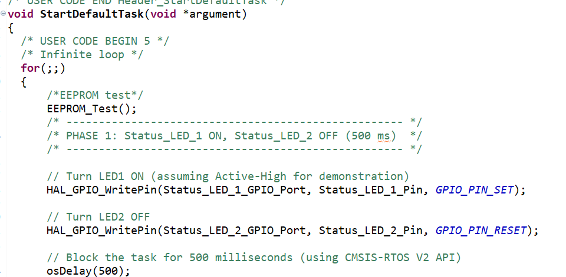
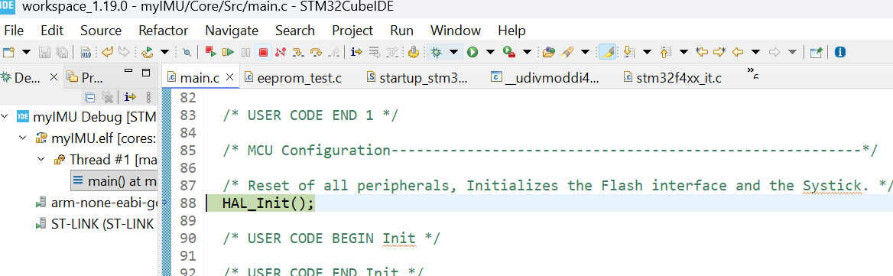

# EEPROM I²C Test Implementation (AT24C256)

This implementation guide and provided code follow a project structure consistent with files **auto-generated by STM32CubeMX**.

---
## Understanding AT24C256 I²C Address (for STM32 HAL)

The **AT24C256** EEPROM uses a **7-bit I²C address**, and its value depends on how the three hardware address pins (**A2**, **A1**, **A0**) are wired.

---

## 📘 Address Table

| A2 | A1 | A0 | 7-bit Address | 8-bit Write Addr | 8-bit Read Addr |
|----|----|----|----------------|------------------|-----------------|
| 0  | 0  | 0  | `0x50`         | `0xA0`           | `0xA1`          |
| 0  | 0  | 1  | `0x51`         | `0xA2`           | `0xA3`          |
| 0  | 1  | 0  | `0x52`         | `0xA4`           | `0xA5`          |
| …  | …  | …  | …              | …                | …               |

- The **7-bit address range** is `0x50`–`0x57`.
- The **8-bit address range** (old datasheet format) is `0xA0`–`0xAE`.

---

##  How STM32 HAL Interprets the Address

STM32 HAL functions such as:

```
HAL_StatusTypeDef HAL_I2C_Mem_Write(
  I2C_HandleTypeDef *hi2c,   // I2C handle, e.g. &hi2c1
  uint16_t DevAddress,       // I2C device address (7-bit shifted left by 1)
  uint16_t MemAddress,       // Memory address inside the device
  uint16_t MemAddSize,       // Internal address size: I2C_MEMADD_SIZE_8BIT or I2C_MEMADD_SIZE_16BIT
  uint8_t *pData,            // Pointer to data buffer
  uint16_t Size,             // Number of bytes to write
  uint32_t Timeout           // Timeout in ms
);
```
The DevAddress argument should be the 7-bit address shifted left by 1, which is A0 in our design:
```
// Correct for AT24C256 with A0~A2 = GND
#define EEPROM_ADDR   (0x50 << 1)   // = 0xA0
```

## Use STM32 HAL for EEPROM tests

### Create New Files

In **STM32CubeIDE**:

1. Right-click `Core/Src` → **New → Source File** → name it: `eeprom_test.c`  
2. Right-click `Core/Inc` → **New → Header File** → name it: `eeprom_test.h`  
3. In `eeprom_test.c`, include the header file:
   ```
   #include "eeprom_test.h"
   ```

### global variables for debugging
In the eeprom_test.h headfile, we will define the eeprom address and make declaration of the essential functions to write and read data from eeprom. Two global variables are defined for debugging.
```
uint8_t writeData[] = "Hello EEPROM!";
uint8_t readData[32] = {0};
```
### Headfile 'eeprom_test.h'
```

#ifndef INC_EEPROM_TEST_H_
#define INC_EEPROM_TEST_H_

/* -------------------------------------------------------------------------- */
/*                          EEPROM I2C configuration                          */
/* -------------------------------------------------------------------------- */
#define EEPROM_I2C                hi2c1              // I2C handle (defined in main.c)
#define EEPROM_ADDRESS            0xA0              // AT24C256 address (A2–A0 = GND)
#define EEPROM_PAGE_SIZE          64                // 64 bytes per page
#define EEPROM_WRITE_DELAY_MS     10                // typical write cycle time

void EEPROM_Test(void);
HAL_StatusTypeDef EEPROM_Read(uint16_t MemAddress, uint8_t *pData, uint16_t Size);
HAL_StatusTypeDef EEPROM_Write(uint16_t MemAddress, uint8_t *pData, uint16_t Size);

#endif /* INC_EEPROM_TEST_H_ */

```
### Source file eeprom_test.c
In the following c file, we use STM32 HAL to write data to EEPROM (AT24C256), and read it back for verification.

```
/**
 ******************************************************************************
 * @file    eeprom_test.c
 * @brief   AT24C256 EEPROM test and driver example for STM32F405
 * @description
 *   This file demonstrates how to initialize I2C, write data to an external
 *   EEPROM (AT24C256), and read it back for verification using STM32 HAL.
 ******************************************************************************
 */

#include "main.h"
#include "eeprom_test.h"
#include <string.h>
#include <stdio.h>


extern I2C_HandleTypeDef hi2c1;                     // imported from main.c

/* -------------------------------------------------------------------------- */
/*                          EEPROM driver functions                           */
/* -------------------------------------------------------------------------- */

/**
 * @brief  Write a block of data to the EEPROM
 * @param  MemAddress: 16-bit memory address in EEPROM
 * @param  pData: pointer to data buffer
 * @param  Size: number of bytes to write
 * @retval HAL status
 */
HAL_StatusTypeDef EEPROM_Write(uint16_t MemAddress, uint8_t *pData, uint16_t Size)
{
    /* Note:
       AT24C256 uses 16-bit memory addressing.
       Ensure write size does not cross a 64-byte page boundary.
    */
    HAL_StatusTypeDef status;

    status = HAL_I2C_Mem_Write(&EEPROM_I2C,
                               EEPROM_ADDRESS,
                               MemAddress,
                               I2C_MEMADD_SIZE_16BIT,
                               pData,
                               Size,
                               100);

    /* Wait for internal write cycle */
    HAL_Delay(EEPROM_WRITE_DELAY_MS);
    return status;
}

/**
 * @brief  Read a block of data from the EEPROM
 * @param  MemAddress: 16-bit memory address in EEPROM
 * @param  pData: pointer to buffer to store read data
 * @param  Size: number of bytes to read
 * @retval HAL status
 */
HAL_StatusTypeDef EEPROM_Read(uint16_t MemAddress, uint8_t *pData, uint16_t Size)
{
    return HAL_I2C_Mem_Read(&EEPROM_I2C,
                            EEPROM_ADDRESS,
                            MemAddress,
                            I2C_MEMADD_SIZE_16BIT,
                            pData,
                            Size,
                            100);
}

/* -------------------------------------------------------------------------- */
/*                              Test function                                 */
/* -------------------------------------------------------------------------- */

/**
 * @brief  EEPROM functional test
 * @note   Write a test string to address 0x0000 and read it back.
 */
uint8_t writeData[] = "Hello EEPROM!";
uint8_t readData[32] = {0};

void EEPROM_Test(void)
{
    /* -------------------- Write test -------------------- */
    printf("EEPROM Write Start...\r\n");
    if (EEPROM_Write(0x0000, writeData, strlen((char*)writeData)) == HAL_OK)
        printf("EEPROM Write Done.\r\n");
    else
        printf("EEPROM Write Error!\r\n");

    /* -------------------- Read test --------------------- */
    printf("EEPROM Read Start...\r\n");
    if (EEPROM_Read(0x0000, readData, strlen((char*)writeData)) == HAL_OK)
    {
        printf("EEPROM Read Done.\r\n");
        printf("Read Data: %s\r\n", readData);
    }
    else
    {
        printf("EEPROM Read Error!\r\n");
    }
}

/*  Key notes
- AT24C256 uses 16-bit addressing.
- Each page = 64 bytes, do not cross page boundary in one write.
- EEPROM_ADDRESS may vary depending on hardware wiring of A0~A2.
- Always include a delay (~10 ms) after writing.
- Confirm I2C lines have proper pull-ups and no bus contention.
*/
```

## Debug mode in STM32IDE

Call the function `EEPROM_Test` in the default task in freertos.
* Include "eeprom_test.h"  in main.c
* Add a line in default_task as below to callback `EEPROM_Test()` function:
  
### Enter Debug Mode

1. Click the **🐞 Debug icon** or press **fn+F11** to start debugging.  
2. STM32CubeIDE will:
   - Build and flash your firmware
   - Automatically open the **Debug Perspective**
3. The program will pause at `main()` by default.
   
4. press **fn+F8** to resume debugging.

---

## Viewing Global Variables

- Go to 'Window → Show View → Live Expressions'
- Add variable names manually: (e.g., `readData`).
- Values will refresh automatically in real time.


From the above Live Expressions window, we can see that the string 'Hello EEPROM!' has been correctly written to EEprom.

## Wrap-Up and Future Work
* In this section, we configured I²C communication and verified basic EEPROM read/write functionality.

* This setup enables persistent storage of application parameters.

* Next steps:

  * Implement UART communication for PC-side debugging and GUI interaction.

  * Use EEPROM for parameter initialization, runtime updates, and configuration storage.

 


