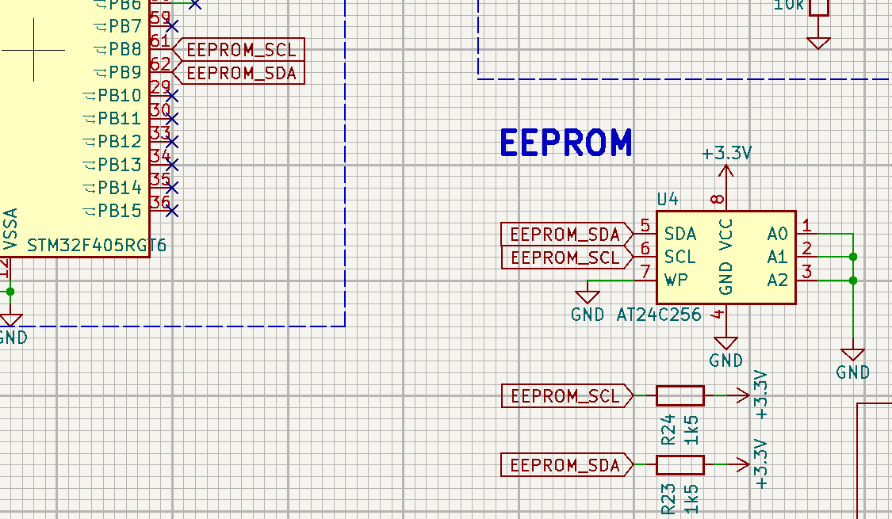
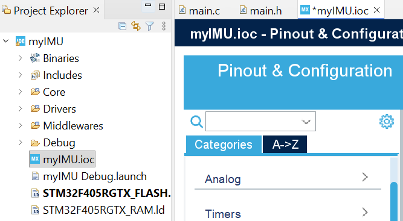
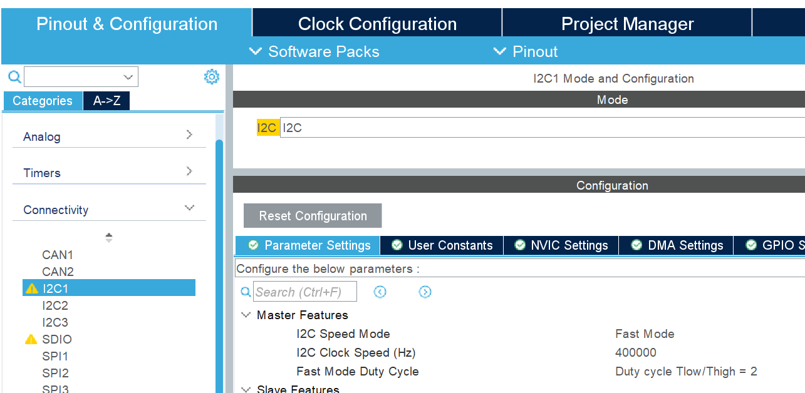

# I²C connection for AT24C256 EEPROM

The **AT24C256 EEPROM** is connected to the **I²C1 peripheral** of the **STM32F405** microcontroller.  
According to the schematic, **PB8 (SCL)** and **PB9 (SDA)** are used as communication pins, each with **1.5 kΩ pull-up resistors** to VCC.

---

## Configure I²C in STM32CubeMX

### Select I²C Pins

Open **STM32CubeMX** by double-clicking the project’s **`.ioc`** file (for example, `myIMU.ioc`) in the Project Explorer.

| Function | Pin | Description |
|-----------|-----|-------------|
| I2C1_SCL  | PB8 | Serial Clock Line |
| I2C1_SDA  | PB9 | Serial Data Line |

---

### Enable and Configure I²C1

1. Click on **PB8** and select **I2C1_SCL**.  
2. Click on **PB9** and select **I2C1_SDA**.  
3. In the **Connectivity** category, select **I2C1** to enable it.  
4. Set **I²C Speed Mode** to **Fast Mode (400 kHz)** for improved performance.  
5. Click **Save** → **Generate Code** to apply changes.

The yellow warning beside I2C1 appears because the SMBA pin of I2C1 has been configured as a GPIO output (used to drive an LED), which causes a potential functional conflict. However, since we are using I2C mode, the SMBA pin does not need to be configured.

Note: The SMBA (System Management Bus Alert) pin is an optional signal used in SMBus communication to allow slave devices to notify the host controller of abnormal conditions, such as faults, errors, or status changes. In standard I2C applications, this pin is typically unused.
---

## Wrap-up

- **Peripheral:** I²C1  
- **SCL Pin:** PB8  
- **SDA Pin:** PB9  
- **Pull-up Resistors:** 1.5 kΩ  
- **Speed:** 400 kHz (Fast Mode)

The STM32 project is now ready for I²C communication with the AT24C256 EEPROM.

---
