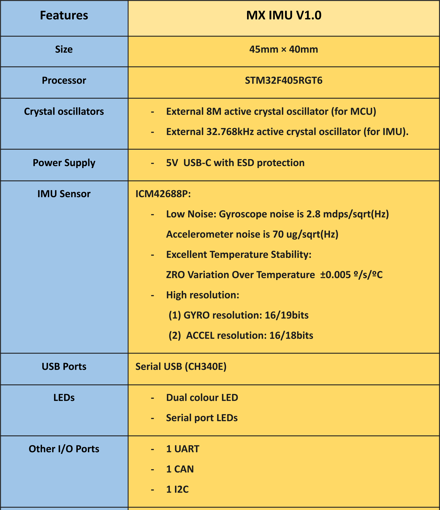
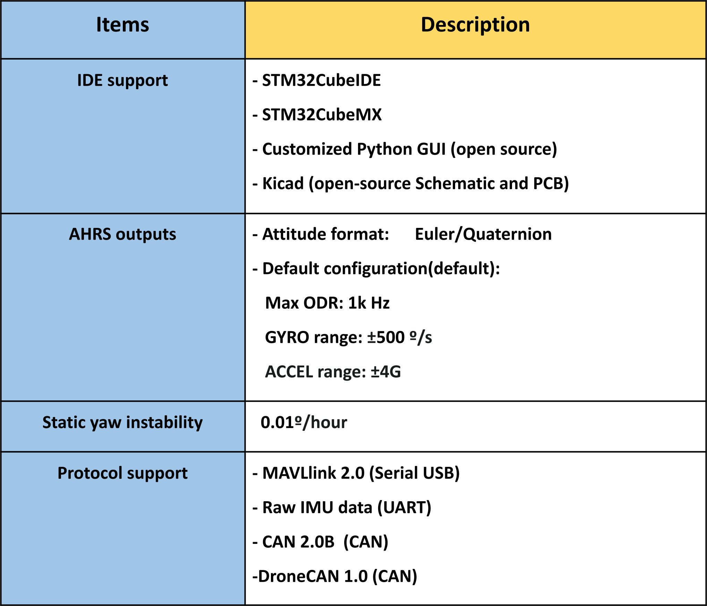

## MX_IMU community On zulip
Join our community for discussions, support, and collaboration:  
https://mxmotion.zulipchat.com/

It is undergoing development, and we welcome contributions from the community.
## Getting Started

This is tutorial for MX_IMU_V1.0.  
It is a fully open-source Inertial Measurement Unit (IMU) development board built around the STM32F405 processor, the ICM42688-P IMU sensor.

It is highly suitable for experiment-oriented purposes, sensor fusion research, and prototype development. The package includes the schematic, PCB layout, firmware source code, and a Python MAVLink-based GUI.

## ⚙️ Key Specifications and Features

## 🔗 Get Started and Start Building

| Objective | Link |
| :--- | :--- |
| **Support Our Project** | **👉 Visit our [Shop on Ebay](https://www.ebay.com/itm/127513085209)** |
| **Hardware Design** | 👉 Visit our **[Hardware Repo](https://github.com/leelili444/Hardware)** (Schematics and PCB with KiCad) |
| **IMU Firmware** | 👉 Visit our **[Firmware Repo](https://github.com/leelili444/imu_firmware)** (Source code with STM32CubeIDE) |
| **IMU GUI** | 👉 Visit our **[GUI Repo](https://github.com/leelili444/IMU_GUI)** (Default GUI with Julia) |
| **Start Learning** | 👉 Visit our **[Tutorial Documentation](https://mx-motion.gitbook.io/tutorial)** (Tutorial for MX_IMU_V1.0) |

