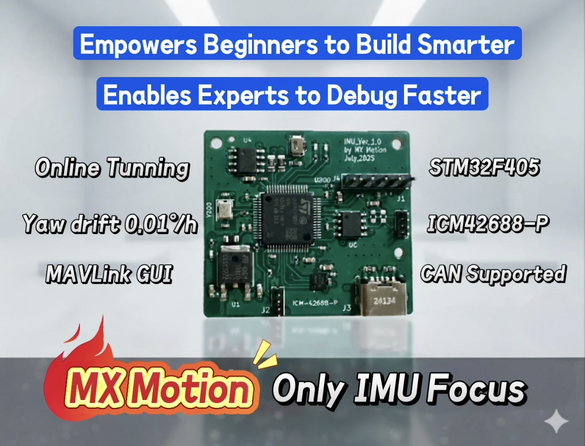

# Getting Started

## 📘 Overview: What This Tutorial Is For

This is the official documentation and tutorial for the MX Motion IMU. This project originated from a core necessity: the lack of a clean, focused, and fully open-source IMU development board. I built this IMU  for experienced engineers like me and those new learner to the field.
This guide provides the essential documentation required to:

* **Quick Start**: The step-by-step process for immediate board activation and prototyping.

* **Architectural Deep Dive**: A full breakdown of the software architecture, focusing on the IMU data pipeline and processing chain.

## 🔗 Get Started and Start Building

| Objective | Link |
| :--- | :--- |
| **Support Our Project** | **👉 Visit our [Kickstarter Project](https://www.kickstarter.com/projects/35546140/ready-to-innovate-imu-platform-for-prototyping-and-learning)** (Help us grow and expand) |
| **Get Files** | 👉 Visit our **[GitHub Repo](https://github.com/leelili444/IMU)** (All open-source hardware and software files) |
| **Start Learning** | 👉 Visit our **[Tutorial Documentation](https://mx-motion.gitbook.io/tutorial)** (Latest technical guides) |

**Your support directly accelerates platform development:**

We are committed to using the funds raised to:
* Refine Hardware Performance: Implement critical hardware optimizations (e.g., enhancing the CAN interface reliability).

* Accelerate Library Expansion: Rapidly integrate and validate new attitude estimation algorithms.

* Expand Practical Documentation: Develop production-ready tutorials and application guides for broader implementation.
  

## 🛠️ Born from Developer Frustration, Engineered for Efficiency

Whether you're an **engineer, student, or seasoned maker**, you've faced the same challenge we have: searching for an ideal IMU development resource often ends in disappointment. I got tired of the time sinks and dead ends trying to make my own IMU work. That frustration was the reason I built the MX Motion IMU:

* **Bloated Platforms:** The "open-source" boards I found were often a **functional grab-bag**, with the IMU becoming an insignificant component, making focused **learning and debugging** difficult.
* **Black Box Design:** Critical **hardware design files were missing**, preventing deep understanding of the underlying principles and making it impossible to **customize or repurpose** the design.
* **Coupled Code:** The software was **not clean or focused**, forcing hours of wasted time stripping out irrelevant functions instead of focusing on **application innovation**.

I was tired of this inefficient cycle of reinventing the wheel. Since a **clean, complete, and purely IMU-focused** platform didn't exist, I built it for all fellow technical enthusiasts who crave **efficiency and depth**. (Shown as below)👇

---

## ✨ Our Commitment: 100% Open Source

The **MX Motion IMU** is an integrated, high-efficiency platform engineered to minimize development overhead and accelerate IMU-based prototyping. It represents the **minimum viable solution** distilled from my own technical exploration.

| Feature | Technical Focus |
| :--- | :--- |
| **Pure Design** | Hardware and software are strictly focused on the IMU, ensuring **zero unnecessary distractions**, making it ideal for learning attitude estimation and driver integration. |
| **Deep Open Source** | We provide **full hardware design files (PCB/Schematics)** and a **clean, maintainable codebase**, eliminating the "black box" obstacle. |
| **Rapid Integration** | The integrated hardware/software design lets you **skip low-level driver development** and immediately dedicate your effort to **algorithm optimization and application building**. |

