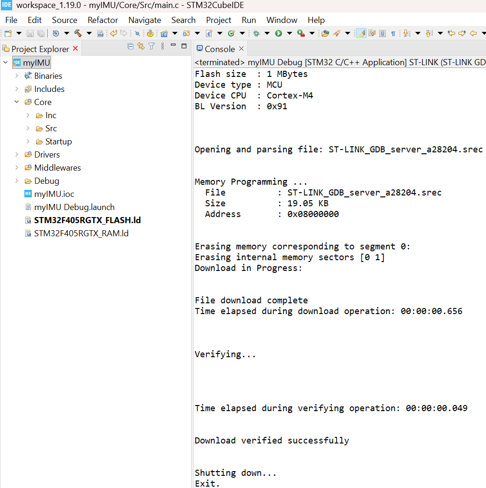

# First task with FreeRTOS

When we enable the FreeRTOS, CMSIS-RTOS V2 is set. Its full name is 'Cortex Microcontroller Software Interface Standard - Real-Time Operating System, Version 2'. It is a standardized API (Application Programming Interface) defined by ARM to provide a vendor-independent abstraction layer for RTOS kernels running on Cortex-M microcontrollers (like the STM32).

## Two-LED Alternating Blinking with FreeRTOS

Here we set up the first task in FreeRTOS 'Two-LED Alternating Blinking with FreeRTOS' using the  `defaultTask` generated by STM32CubeIDE.

The GPIO pins connected to the two LEDs have been defined as:
~~~
#define Status_LED_1_Pin GPIO_PIN_4
#define Status_LED_1_GPIO_Port GPIOB
#define Status_LED_2_Pin GPIO_PIN_5
#define Status_LED_2_GPIO_Port GPIOB
~~~

| User Label | Pin | Port Definition | Pin Definition |
| :---: | :---: | :---: | :---: |
| **Status_LED_1** | PB4 | `Status_LED_1_GPIO_Port` (GPIOB) | **`Status_LED_1_Pin`** (GPIO_PIN_4) |
| **Status_LED_2** | PB5 | `Status_LED_2_GPIO_Port` (GPIOB) | **`Status_LED_2_Pin`** (GPIO_PIN_5) |

## Understanding the FreeRTOS Task Execution Flow

Before implementing the blinking logic, it's vital to understand how FreeRTOS manages the **`defaultTask`** execution:

1.  **Task Creation:** 
   In the main function, the `defaultTask` is created via `osThreadNew()`, linking it to its start function, **`StartDefaultTask`** and task attributes structure **`defaultTask_attributes`**.
   ~~~
     defaultTaskHandle = osThreadNew(StartDefaultTask, NULL, &defaultTask_attributes);
   ~~~
2.  **Scheduler Start:**   
   Calling `osKernelStart()` transfers control to the **FreeRTOS kernel**. The scheduler then executes the highest-priority ready task (our `defaultTask`).
3.  **The Infinite Loop:** The code runs inside an essential **`for (;;)`** (infinite) loop. An RTOS task must never exit its function.
~~~
void StartDefaultTask(void *argument)
{
  /* USER CODE BEGIN 5 */
  /* Infinite loop */
  for(;;)
  {
    osDelay(1);
  }
  /* USER CODE END 5 */
}
~~~
4. **osDelay()**   
   When the task executes **`osDelay(500)`**:
    * The task is immediately moved from the **Running** state to the **Blocked** state for 500 milliseconds.
    * The **CPU is not halted**. The scheduler yields the CPU, checking for any other tasks to run. If there are none, the CPU enters a low-power **Idle** state.
    * After 500 milliseconds, the task is moved back to the **Ready** state, and the scheduler allows the CPU to resume execution from the line immediately following the `osDelay(500)` call.

This non-blocking delay is crucial for RTOS, ensuring the CPU isn't wasted while a task waits for time to pass.

## Step 3: Implement the Alternating Blink Logic

The **`StartDefaultTask`** function is in `main.c`, and place the following logic inside its infinite for (;;) loop. Contents within the USER CODE BEGIN and END sections will not change when you generate the code more times.

~~~
void StartDefaultTask(void *argument)
{
  /* USER CODE BEGIN 5 */
  /* Infinite loop */
  for(;;)
  {
	  /* ---------------------------------------------------- */
	  /* PHASE 1: Status_LED_1 ON, Status_LED_2 OFF (500 ms)  */
	  /* ---------------------------------------------------- */

	  // Turn LED1 ON (assuming Active-High for demonstration)
	  HAL_GPIO_WritePin(Status_LED_1_GPIO_Port, Status_LED_1_Pin, GPIO_PIN_SET);

	  // Turn LED2 OFF
	  HAL_GPIO_WritePin(Status_LED_2_GPIO_Port, Status_LED_2_Pin, GPIO_PIN_RESET);

	  // Block the task for 500 milliseconds (using CMSIS-RTOS V2 API)
	  osDelay(500);

      /* ---------------------------------------------------- */
      /* PHASE 2: Status_LED_1 OFF, Status_LED_2 ON (500 ms)  */
      /* ---------------------------------------------------- */

      // Turn LED1 OFF
      HAL_GPIO_WritePin(Status_LED_1_GPIO_Port, Status_LED_1_Pin, GPIO_PIN_RESET);

      // Turn LED2 ON
      HAL_GPIO_WritePin(Status_LED_2_GPIO_Port, Status_LED_2_Pin, GPIO_PIN_SET);

      // Block the task for another 500 milliseconds
      osDelay(500);

      // Total period: 500ms + 500ms = 1000ms (1 second)
  }
  /* USER CODE END 5 */
}
~~~
## Step 4: Compile and Flash

This final step transfers your compiled FreeRTOS application onto the STM32 microcontroller.

1.  **Save** all files in your project.
2.  **Build** your project by clicking the **Project** menu -> **Build Project** (or use the hammer icon in the toolbar).
    * _Wait for the build process to complete successfully without errors._
3.  **Flash** the compiled code to your STM32 development board by clicking the **Run** menu -> **Run** or **Debug** (for flashing and starting execution). ST-Link needs to be connected. IDE will detect the ST-Link and set up for you.

Upon successful flashing, your two LEDs (on PB4 and PB5) will immediately begin alternating their state every 500 **milliseconds**, achieving the desired **1-second cycle**, confirming the `defaultTask` is running correctly.

Next time we will set up timers and run periodically with predefined frequency.