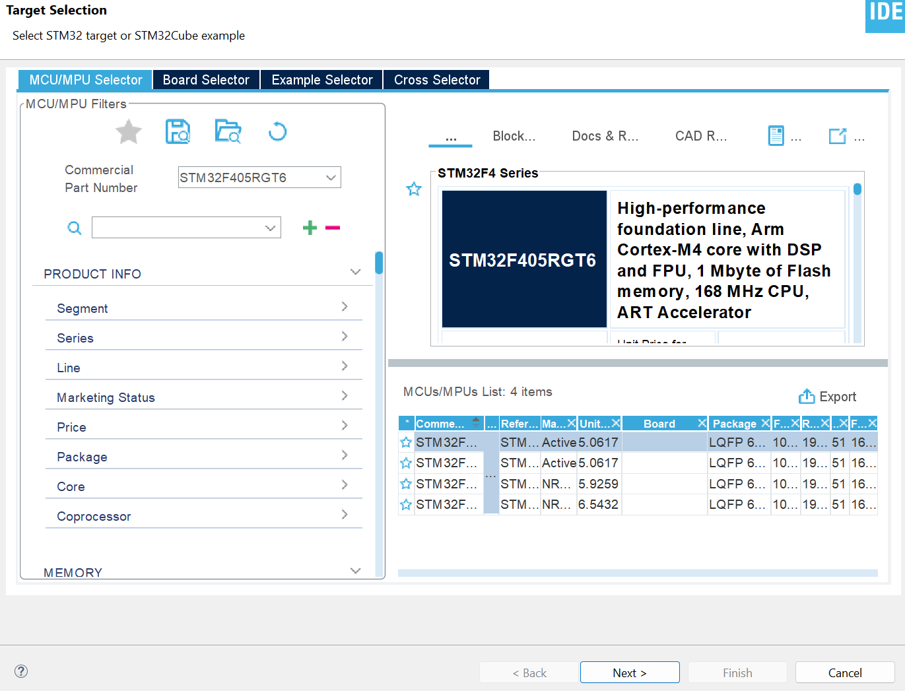
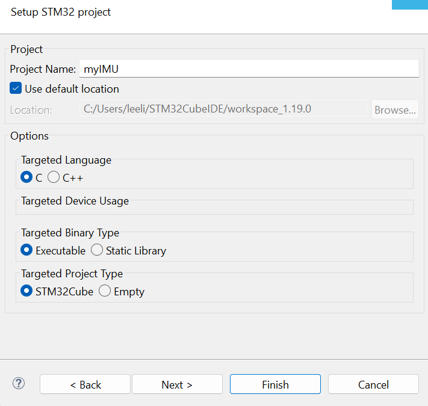

# Start with stm32CubeIDE
## New STM32 Project
* Use File -> New -> STM32 Project to create it
* The IDE pops up a 'Target selection' window. In the section 'Commercial Part Number', input the processor model 'STM32F405RGT6', and on the right side of the window, several MCUs are filtered out. Click on the line of STM32F405RGT6, and click on 'Next'.

*  Then, give a proper name to this project. You can leave the rest of the options at their default values. Click Finish and the IDE will open your project and open a tab called 'myIMU.ioc'. This tab is the window of STM32CubeMX Device Configuration Tool.  

## Configure the MCU
Now you can configure the MCU as per the [imu schematic]() of MX Motion IMU board, which you can find in repo.

