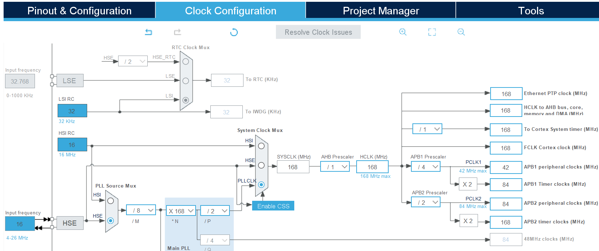
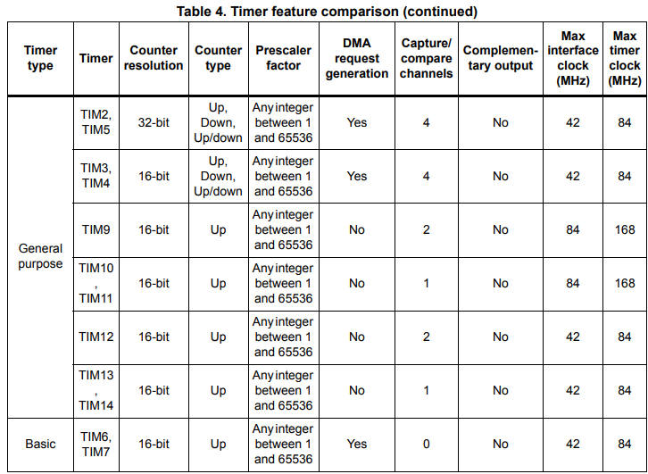
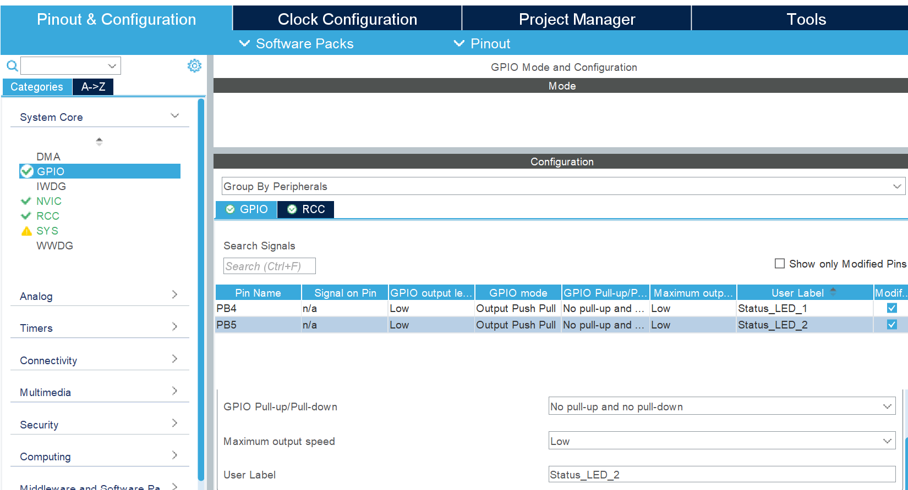
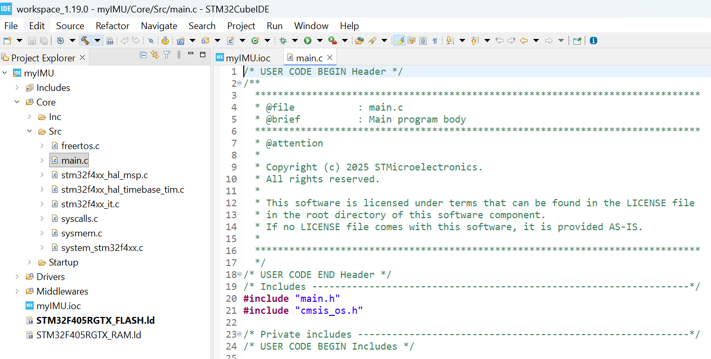

# Start with stm32CubeIDE
## New STM32 Project
* Use File -> New -> STM32 Project to create it
* The IDE pops up a 'Target selection' window. In the section 'Commercial Part Number', input the processor model 'STM32F405RGT6', and on the right side of the window, several MCUs are filtered out. Click on the line of STM32F405RGT6, and click on 'Next'.

*  Then, give a proper name to this project. You can leave the rest of the options at their default values. Click Finish and the IDE will open your project and open a tab called 'myIMU.ioc'. This tab is the window of STM32CubeMX Device Configuration Tool.  

## Configure the MCU
Now you can configure the MCU as per the [imu schematic](https://github.com/leelili444/IMU/blob/main/Hardware/Schematic.pdf) of MX Motion IMU board, which you can find in repo.

The first tab in the Device Configureation tool is the 'Pin out and configuration' of MCU. Some essential pins and peripherals used in the IMU board will be configured in the following steps.

### Clock configuration
There is a external clock in the form of a 16MHz crystal oscillator on the IMU board, which is a  
connected across pin5 and pin6, which are the input pin and output pin of external oscillator.    

* RCC Mode and Configuration
  * In the Device Configuration Tool, expand the 'System Core' section and choose the 'RCC' (Reset and Clock Controller) peripheral.
  * In the active 'Mode' panel, change the HSE (High-Speed Clock) setting to Crystal/Ceramic Resonator.
  * It will enable and label the two oscillator pins as RCC_OSC_IN and RCC_OSC_OUT.  

* Clock Tree Configuration
  By default it still uses the HSI (High-speed Internal) as the main clock source, unless we customize the clock in the tab 'Clock Configuration' on the top.
  * Set the HCLK and PLL Source
  HCLK is the bus clock which frequency is up to 168 MHz for stm32f405. Set the HCLK to 168MHz; the tool will auto-adjust the parameters. Then, change the PLL Source to HSE and set input frequency with 16Mhz, and set the HCLK to 168MHz again.  
    

  Timer1, Timer2 and Timer3 are used in MX Motion IMU. Based on the datasheet, individual timer frequency shown as:

| Timer | Type | Connected Bus | Timer Frequency Used |
| :---: | :---: | :---: | :---: |
| TIM1 | Advanced-control Timer | APB2 | 168 MHz |
| TIM2 | General-purpose Timer | APB1 | 84 MHz |
| TIM3 | General-purpose Timer | APB1 | 84 MHz |

### GPIO Configuration
Two red LEDs are connected to PB4 and PB5 pins.  Go to the 'Pinout & Configuration' tab and click on the 'PB4' pin and set it as 'GPIO_Output' to drive the LED. Do the same setting to PB5 pin. Then Click the GPIO section on the left side under 'System Core' and you can find the two pins are list in a table. There you can assign meaningful user lable to the pins seperately.

When the project code is generated, these two pins will be defined in 'main.h' as below.
| User Label | Pin | Port Definition | Pin Definition |
| :---: | :---: | :---: | :---: |
| **LED1** | PB4 | `LED1_GPIO_Port` (which is GPIOB) | **`Status_LED_1_Pin`** (which is GPIO_PIN_4) |
| **LED2** | PB5 | `LED2_GPIO_Port` (which is GPIOB) | **`Status_LED_2_Pin`** (which is GPIO_PIN_5) |

### SWD Configuration
MX Motion IMU uses Stlink for code debugging.Enable SWD as follows: 
* Under 'System Core' on the left side, click on SYS, and in the 'Debug' option in the Mode Configuration, select 'Serial Wire'. 
* Set the 'Timebase Source' option to 'TIM3'. This is recommended because when using FreeRTOS, a HAL-based timer provides more reliable and dedicated timekeeping than the default system tick (SysTick) timer.
* As soon as you do this, the PA13 and PA14 pins will be set as SWDIO and SWCLK.  
  

## Enable FreeRTOS
* From the left, click FreeRTOS under 'Middleware and Software' and select CMSIS_V2 to enable FreeRTOS.    

* The IDE will pop up a window to remind you to set the Newlib：
  
* Task
  There is a default task. We will use it to run the LED blinking.
  

## Code Generation
Press 'ctrl + S' to save the 'Device Configuration Tool', and the IDE will start to generate the code. The project explorer looks like:  

We will look into the code more next time and build the first FreeRTOS task for IMU board.
  