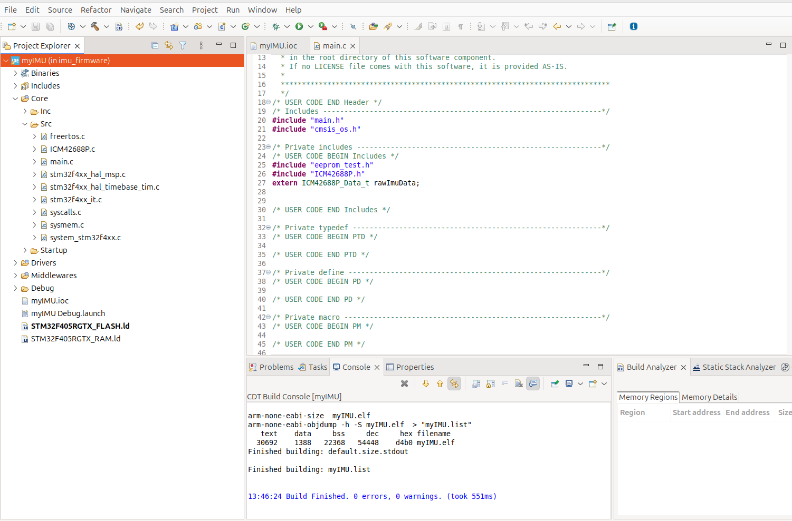

# Building the code

## Download the source code from repo
* The STM32 project is on the main branch of the imu_firmware repo:  
  👉 [Firmware Repo](https://github.com/leelili444/imu_firmware)
* Double click the project file ".cproject" and STM32CubeIDE will be launched.
## Build and upload
* Click menu "Project->Build All"  to build the project.
* Connect ST-Link V2 to the board
* Click menu "Run->Debug" will launch the Debug mode.
* Click menu "Run->Run" will build and upload the firmware via ST-Link. 

## GUI support
The default GUI is developed using Julia language. Please refer to [MX Motion Julia GUI](getting-started/mx-motion-gui-julia.md) for setup and code structure of the GUI.

Julia has better performance than Python in handling high frequency serial data. If you prefer Python, please refer to [MX Motion Python GUI](getting-started/mx-motion-gui-python.md) for setup and code structure of the Python GUI.

Plan to support both Julia and Python GUI for different user preferences in the scheduled future.