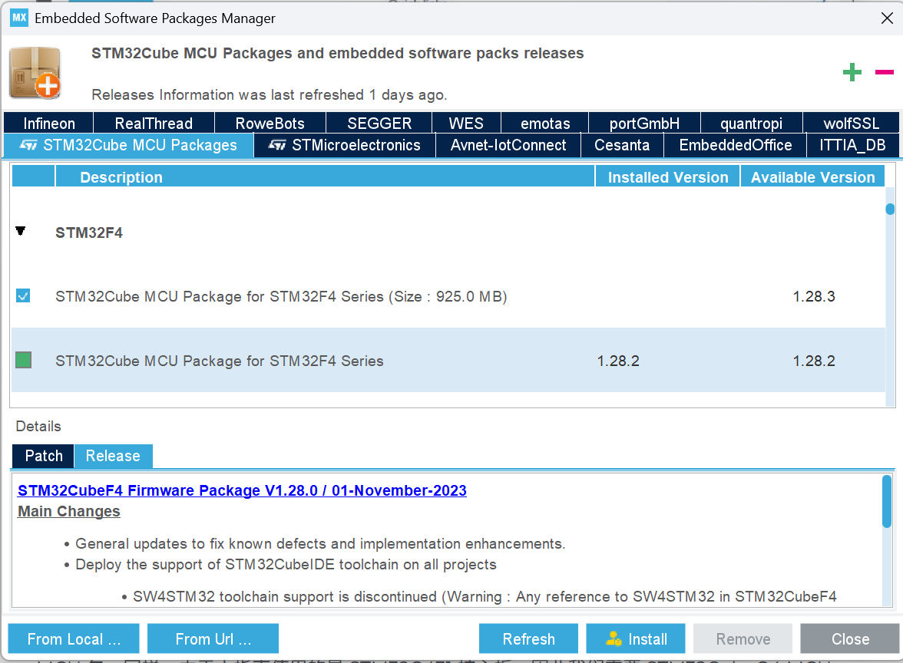

# Dev environment setup (for Windows)

## STM32 board devleopment 
* [STM32CubeIDE Version: 1.19.0](https://www.st.com/en/development-tools/stm32cubeide.html)
* [STM32CubeMX  Version: 6.15.0](https://www.st.com/content/st_com/en/stm32cubemx.html)
* **Install software packages for STM32F4**  
  ST has created STM32Cube MCU packages for different series of STM32 processors.  The package is MCU specific and contains all the low-level files, which are：
    * HAL (Hardware Abstraction Layer) APIs
    * LL (Low-layer) APIs
    * ARM Cortex-M CMSIS files
    * BSP (Board Support Package) files
    * Additional utilities and drivers. 
    * User can also deploy FreeRTOS in the project.
  
  MX Motion IMU uses the STM32F405 processor, so after the installation of STM32CUbeIDE, the STM32CubeF4 MCU package is also needed.  
    * Go to Help->STM32Cube Updates->connection to myST, and enter your password to login with ST account.  
    * Then go to Help->Configuration Tool->Manage Embedded Software Packages. A new window with title ‘Embedded Software Packages Manager’ will popup.
    * Select the ‘STM32Cube MCU Packages’ tab in the top, and find the ‘STM32F4’ series. The latest version is 1.28.3.  
  
## Python environment
* [Anaconda3-2025.06-0-Windows-x86_64](https://www.anaconda.com/blog/new-release-anaconda-distribution-2025-06)
* PyCharm comes along with Anaconda3.   
  Using PyCharm, the following libraries need to install:
    * Pyqt6  
      a set of Python bindings for the cross-platform Qt application framework, used to create graphical user interfaces (GUIs).
    * [PyMAVLink](https://mavlink.io/en/mavgen_python/)  
      * It is a low level and general purpose MAVLink message processing library. MAVLink also has a version supporting c programme language. 
      * In STM32 we also C version MAVLink to handle MAVLinl messages.

## Source code management
* install [Github Desktop](https://desktop.github.com/download/)
* download code from [MX Motion Firmware repo](https://github.com/leelili444/imu_firmware)
  
## Online manuals
We mainly need the following manuals:
* [STM32F405RGT6](https://www.st.com/resource/en/datasheet/dm00037051.pdf)
* [ICM42688-P](https://invensense.tdk.com/download-pdf/icm-42688-p-datasheet/)