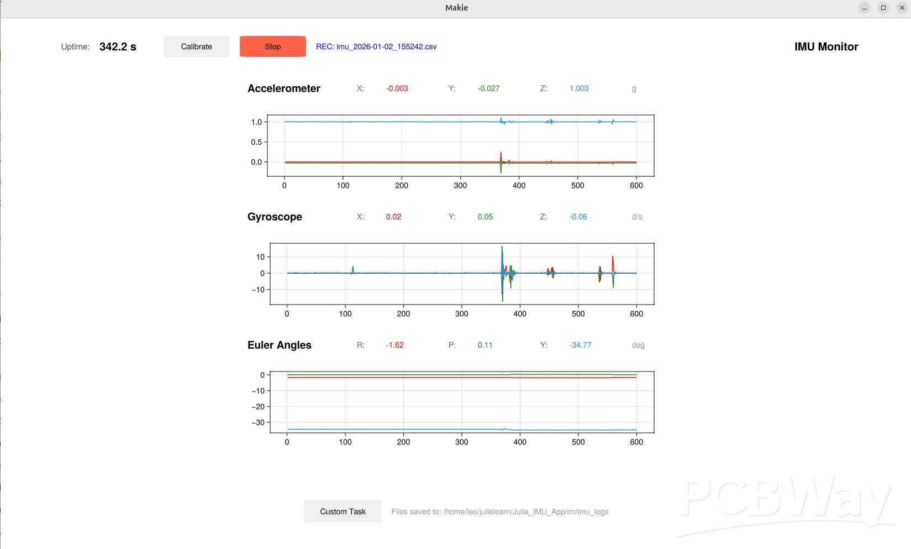

# MX Motion GUI using Julia
This GUI is developed using Julia programming language with Makie.jl for real-time plotting and serialport.jl for hardware communication. The GUI provides high-performance IMU data monitoring and acquisition capabilities.
## Download the code from branch App_Julia
```
git clone https://github.com/leelili444/IMU_GUI.git
```
Checkout App_Julia
```
cd IMU_GUI
git checkout App_Julia
```
This system is a high-performance IMU real-time monitor and data acquisition client implemented in Julia. It is designed for high-rate serial data and balances UI responsiveness with preservation of raw hardware data.



---

## 1. Overall Architecture

The system uses an "asynchronous producer-consumer" architecture, leveraging Julia Tasks to fully decouple the UI from the data stream.

### Core layered design:
1. **Static Configuration Layer (`CONFIG`)**: Centralized global parameters. UI sizes, save paths, and sampling settings are defined here; changing values here rearranges layout and runtime behavior.
2. **State Management Layer (`AppState`)**: Stores runtime state (e.g., calibration offsets, recording flags, uptime). This is the single communication surface between the UI and background tasks.
3. **Asynchronous Parsing Layer (`@async` task)**: The program's "heart". It continuously listens to the serial port, validates raw byte streams, parses protocol frames, saves data, and pushes refresh/update signals to the UI.
4. **Rendering Layer (`GLMakie`)**: GPU-accelerated renderer that draws processed data as real-time waveforms.

---

## 2. Developer Reference (code vs functionality)

| Module | Source location (key variable / block) | Description |
| :--- | :--- | :--- |
| **Layout parameters** | `const CONFIG` | Change the `block.ratios` array to adjust vertical share of each plotting row. |
| **State tracking** | `mutable struct AppState` | Add global state fields (e.g., packet loss counters) here. |
| **Plot unit factory** | `create_sensor_block!` | Encapsulates a waveform window with numeric readouts. Call this factory to add a new sensor pane. |
| **Protocol parsing** | `while length(raw_buffer) >= 52` | Core frame unpacking logic. If frame length or offsets change, modify this section. |
| **Extension slot** | `g_extension` | Reserved UI area where developers can add a button or control panel with minimal changes. |

---

## 3. Performance strategies: keep plotting smooth and fast saving

In high-rate sampling scenarios (e.g., 1000 Hz), the system uses the following techniques to remain stable:

### 3.1 Smooth plotting (GPU Acceleration)
* **Circular buffer**:
    ```julia
    obs_acc[i].val = circshift(obs_acc[i].val, -1)
    obs_acc[i].val[end] = new_data
    ```
    Using `circshift` avoids frequent memory allocations and deallocations, greatly reducing GC-induced stutters.
* **UI refresh throttling**:
    The UI refresh rate is controlled by `CONFIG.data.refresh`. Even if the hardware emits thousands of frames per second, the UI rendering stays at a stable rate (e.g., ~20 Hz) to ensure smooth visuals without overloading the GPU.

### 3.2 High-speed data persistence (Zero-Lag Persistence)
* **Zero-copy binary conversion**:
    ```julia
    fs = reinterpret(Float32, frame[13:48])
    ```
    `reinterpret` maps raw bytes directly to floats, which is orders of magnitude faster than text parsing.
* **Non-blocking writes**:
    Parsing and printf writing are done inside the asynchronous worker, so UI interactions remain responsive.
* **Automatic path handling**:
    The app calls `mkpath` to ensure the save directory exists, avoiding crashes due to missing folders.

### 3.3 Hardware communication tuning (Linux Serial Tuning)
For high-rate streams at 921600 bps, the system relies on the following system-level optimizations:
* **Raw mode configuration**: Set the serial port to raw mode with `stty` to disable echo and special character processing, ensuring binary packets (including bytes like 0x0A) are not intercepted or transformed by the kernel.
    ```
    sudo stty -F /dev/ttyUSB0 921600 raw -echo -echoe -echok
    ```
* **Low-latency mode**: Enable the `low_latency` flag via `setserial`. This forces the driver to deliver bytes to Julia immediately when they arrive instead of waiting for kernel buffer thresholds, effectively eliminating bursts and related stalls.
    ```
    sudo setserial /dev/ttyUSB0 low_latency
    ```

---

## 4. Extension guide: how to add custom features

1. **Add an analysis button**:
    Under the `g_extension` block add:
    ```julia
    btn_ana = Button(g_extension[1, 1], label = "Run FFT")
    on(btn_ana.clicks) do _
        # your analysis code here
    end
    ```
2. **Change saving logic**:
    Edit the `on(btn_record.clicks)` handler to modify how `fname` is generated or to change the CSV header printed with `println`.
3. **Fix axis ranges**:
    In `create_sensor_block!` call `ylims!(ax, min, max)` to set static axis limits.

---

## 5. Maintainer notes
* **Serial port setup**: Ensure the serial port is configured with `stty` and `setserial` commands in [serial configuration](#33-hardware-communication-tuning-linux-serial-tuning)before launching the GUI for optimal performance.
* **Safe shutdown**: Always click the `Stop` button to end recording so that disk buffers are fully flushed to the CSV file.
* **Calibration requirement**: When clicking `Calibrate`, ensure the IMU is level and stationary.
* **Default foler for data log** : The default folder for saving data logs is `./data_logs/`. Make sure this folder exists or modify the path `save_dir` in the `CONFIG` block.


