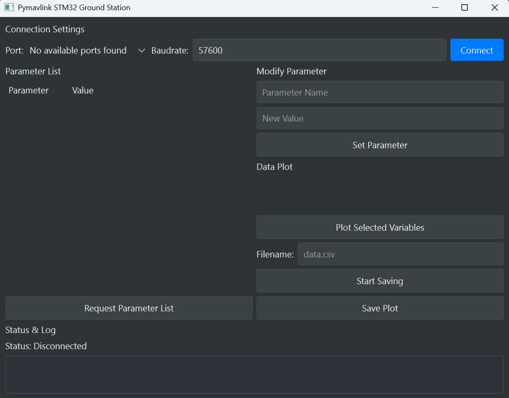

# MX Motion GUI
## Main feature
* **Real-time data monitor**
  Receiving MAVLink messages sent from IMU, such as heartbeat, attitude or raw imu data.
* **Data logging**
  Data will be saved into csv file with 500Hz.  The frequency is hardcoded in the GUI source code.
* **Online parameter tunning**
  Receiving and updating parameters in the IMU. The selection of filter algorithms and filters tunning will be conducted via online parameters from GUI.

## Build and start GUI

* Start "Anaconda Navigator"
* Launch "PyCharm"  
* Open GUI folder in PyCharm  
  GUI folder is "IMU\gcsV1.0_EN"
* Open main.py
* Push down"Shift + fn + F10" to run "main.py"  
  The GUI will pop up.

  

## Code folder structure
| File Name | Extension | Type/Purpose | Analysis |
| :--- | :--- | :--- | :--- |
| **flight\_data.csv** | `.csv` | Data File | Stores **logged flight data** (attitude, sensor readings, etc.). |
| **main.py** | `.py` | Python Script | The **main entry point** of the application, responsible for initialization, loading the GUI (likely `mainwindow.ui`), and starting the main loop. |
| **mainwindow.ui** | `.ui` | UI Definition File | Generated by **Qt Designer**, this defines the layout and components of the main application window. |
| **mavlink\_worker.py** | `.py` | Python Module |Handles the **MAVLink protocol** for communicating with IMU, including connection management, message parsing, and command sending. |
| **plot\_window.py** | `.py` | Python Module | Dedicated to the logic for a **data plotting window** (e.g., plotting atitude curves). |
| **qgroundcontrol.qss** | `.qss` | Stylesheet File | A **Qt Style Sheet** file used to define the look and feel (theming, colors, fonts) of the GUI elements. |
| **ui\_mainwindow.py** | `.py` | Python Module | **Auto-generated** from `mainwindow.ui` by like `pyuic`, converting the UI definition into a usable Python class. |

## GUI layout description
