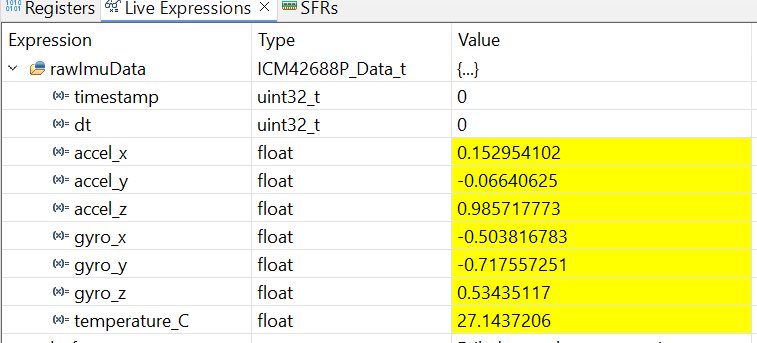
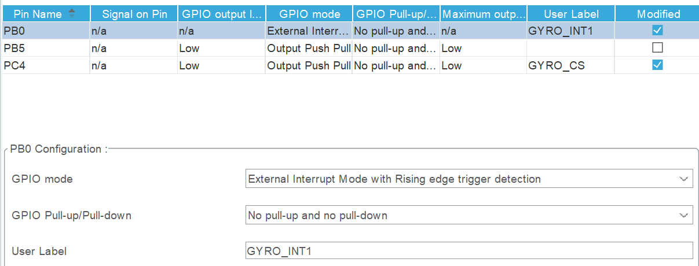
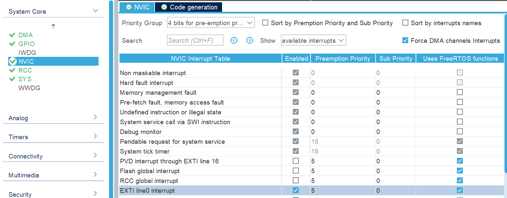

# Complete headfile for ICM42688P
Compared with previous imu initiliaztion demo, we need complete definitions for ICM42688P to read data. While It is time costing to write the register definitions based on the datasheet. One way to do this is to use the example code provied by Invensense. 

You can find the software called '**DK-42688-P SmartMotion eMD**' on this [link](https://invensense.tdk.com/products/motion-tracking/6-axis/icm-42688-p/).  The headfile 'Icm426xxDefs.h' has the complete register definitions for the IMU, which relative path is 'smartmotion-dkexamples-atmel-cm4-fpu-2.0.9\sources\Invn\Drivers\Icm426xx'.

My way to use this code is to add the whole 'Icm426xxDefs.h' and include it in my headfile 'ICM42688P.h'. Before doing this, we need add a line of code to clarify we are using ICM42688P, because the 'Icm426xxDefs.h' is coded for all the icm426xx variants.
```
// ...existing code...
#include <stdint.h>
#define ICM42688P
// ...existing code...
```

# Coding to Get and Decode Data  
Here we recall the diagram below and start to work on the application functions like ICM42688P_Init(), ICM42688P_GetData(), etc.
```
                            HAL_SPI_TransmitReceive
                                     ↑
                                     │  (HAL Library)
                                     │
                            hal_Spi1_ReadWriteByte()
                                     ↑
                                     │  (lowest-level SPI byte transfer)
                                     │
                             Icm_Spi_ReadWriteNbytes()
                                     ↑
                                     │  (multi-byte transfer abstraction)
                                     │
                 ┌────────────────────────────────┐
                 │  ICM42688P_ReadReg()           │
                 │  ICM42688P_ReadRegs()          │
                 │  ICM42688P_WriteReg()          │
                 └────────────────────────────────┘
                                     ↑
                                     │  (device-specific read/write API)
                                     │
                 ICM42688P_Init(), ICM42688P_GetData(), etc.
                                     ↑
                                     │  (application level)
                                     │
                                    main()
```

## ICM42688P_Init()
Before coding, we should have a rough concept about how to initialize the IMU. The general considerations are given below:
* (1) We need to wait several ms for complete start of the IMU sensor, for example 50ms;
* (2)Reset the internal registers and restores the default settings. Still need to wait 50ms to make sure the soft reset is complete.
* (3)Check if we can read the WHO_AM_I of the device.
* (4)Configure the low noise mode.
* (5)Configure the gyro and accel FSR and ODR.
* (6)Confirm the FIFO is disabled.
* (7)Configure the interrupt.

The following is the code with comments:
```
void ICM42688P_Init(void)
{
	/* (1) wait 50ms for the sensor to power up completely */
    HAL_Delay(50);
    /* (2) soft reset */
    // select Bank 0
    ICM42688P_WriteReg(MPUREG_REG_BANK_SEL, 0);
    // soft reset
    uint8_t data = ICM426XX_DEVICE_CONFIG_RESET_EN;
    ICM42688P_WriteReg(MPUREG_DEVICE_CONFIG, data);
    HAL_Delay(50);
    /* (3) check Device ID*/
    uint8_t who_am_i = ICM42688P_ReadReg(MPUREG_WHO_AM_I);
    if (who_am_i != ICM_WHOAMI) {
        while(1){
        	HAL_GPIO_TogglePin(GPIOB, GPIO_PIN_4);
          	 HAL_Delay(10);
        };
    }else {
    	HAL_GPIO_TogglePin(GPIOB, GPIO_PIN_4);
    	HAL_Delay(1000);
    }
    /* (4)Configure Low noise mode*/
    // select Bank 0
    ICM42688P_WriteReg(MPUREG_REG_BANK_SEL, 0);
    // set LN mode for gyro and accel
    ICM42688P_WriteReg(MPUREG_PWR_MGMT_0, ICM426XX_PWR_MGMT_0_GYRO_MODE_LN | ICM426XX_PWR_MGMT_0_ACCEL_MODE_LN);
    /* (5) Configure FSR and ODR*/
    // Gyroscope Configuration: Set 500dps FSR and 1kHz ODR.
    ICM42688P_WriteReg(MPUREG_GYRO_CONFIG0, ICM426XX_GYRO_CONFIG0_FS_SEL_500dps | ICM426XX_GYRO_CONFIG0_ODR_1_KHZ);
    // Accelerometer Configuration: Set 4g FSR and 1kHz ODR.
    ICM42688P_WriteReg(MPUREG_ACCEL_CONFIG0, ICM426XX_ACCEL_CONFIG0_FS_SEL_4g | ICM426XX_ACCEL_CONFIG0_ODR_1_KHZ);
    /* (6) Disable FIFO stream*/
    data = ICM426XX_FIFO_CONFIG_MODE_BYPASS;
    ICM42688P_WriteReg(MPUREG_FIFO_CONFIG, data);
    /* (7) Configure the interrupt mode*/
    // -set pulse mode -- the INT1 pin generates a short, fixed-duration pulse upon an interrupt event.
    // The pulse automatically self-clears after its duration.
    // -set Drive circuit to push pull-Since IMU board lacks the external pull-up resistor for the int1 pin,
    // the Push-Pull configuration is needed to ensure the interrupt signal can successfully transition to
    // the HIGH state when the interrupt is inactive or cleared.
    //- set polarity high- The INT1 pin is driven High when an interrupt occurs.
    ICM42688P_WriteReg(MPUREG_INT_CONFIG,ICM426XX_INT_CONFIG_INT1_DRIVE_CIRCUIT_PP | ICM426XX_INT_CONFIG_INT1_POLARITY_HIGH);
    // INT_SOURCE0--we care about two events to trigger interrupt signal:
    // imu reset and imu data ready
    ICM42688P_WriteReg(MPUREG_INT_SOURCE0, BIT_INT_SOURCE0_RESET_DONE_INT1_EN |BIT_INT_SOURCE0_UI_DRDY_INT1_EN);
}

```

## ICM42688P_GetData(ICM42688P_Data_t *data)

Define a structure to store the raw data from IMU:
```
typedef struct {
    uint32_t timestamp;
    uint32_t dt;
    float accel_x, accel_y, accel_z;
    float gyro_x, gyro_y, gyro_z;
    float temperature_C;
} ICM42688P_Data_t;
```
The registers of these raw data are consistent:
- Temeperature(0x1D,0x1E)
- ACCEL_DATA_X(0x1F,0x20)
- ACCEL_DATA_Y(0x21,0x22)
- ACCEL_DATA_Z(0x23,0x24)
- GYRO_DATA_X(0x25,0x26)
- GYRO_DATA_Y(0x27,0x28)
- GYRO_DATA_Z(0x29,0x2A)

Use ICM42688P_ReadRegs read multiple registers from 0x1D, the data length is 14 bytes. The timestamps needs timer1 which is not configured yet. So, here a test function to read raw data from IMU is given as below. And scale factors for gyro and accelera, temperature are used to convert the raw data to meaningful data for human.
```
ICM42688P_Data_t ICM42688P_GetData(ICM42688P_Data_t *data) {
    uint8_t buf[14];

    ICM42688P_ReadRegs(MPUREG_TEMP_DATA0_UI, buf, 14);

    data->temperature_C = ICM42688P_ConvertTemp((int16_t)((buf[0] << 8) | buf[1]));

    data->accel_x = ICM42688P_ConvertAccel((int16_t)((buf[2] << 8) | buf[3]),ICM42688P_ACCEL_4G_SENSITIVITY);
    data->accel_y = ICM42688P_ConvertAccel((int16_t)((buf[4] << 8) | buf[5]),ICM42688P_ACCEL_4G_SENSITIVITY);
    data->accel_z = ICM42688P_ConvertAccel((int16_t)((buf[6] << 8) | buf[7]),ICM42688P_ACCEL_4G_SENSITIVITY);

    data->gyro_x = ICM42688P_ConvertGyro((int16_t)((buf[8] << 8) | buf[9]),ICM42688P_GYRO_500DPS_SENSITIVITY);
    data->gyro_y = ICM42688P_ConvertGyro((int16_t)((buf[10] << 8) | buf[11]),ICM42688P_GYRO_500DPS_SENSITIVITY);
    data->gyro_z = ICM42688P_ConvertGyro((int16_t)((buf[12] << 8) | buf[13]),ICM42688P_GYRO_5000DPS_SENSITIVITY);
    return data;
}
```
We put the function ICM42688P_GetData in the defualt task and can observe the data in the debug mode of STM32IDE. This is called the Register Mode to obtain data periodically. It shows that gyro data is not zero, since the zero-bias of gyro. Before we use the data for attitude estimation, the zero-bias should be removed.




## void HAL_GPIO_EXTI_Callback(uint16_t GPIO_Pin)

**HAL_GPIO_EXTI_Callbackis** a weakly defined callback in the HAL library that handles external interrupt events. Because it's weak, we can implement a strong version of the function to process the interrupt without explicit declaration. This function serves as the interrupt handler: when an interrupt is detected from the IMU, the associated function for reading IMU data will be called.  

However, before using the interrupt mode to acquire raw data from the IMU, we must first configure the corresponding INT1 pin which is connected with the pin PB0 on the F405 processor. 
- PB0 should be configured to 'External Interrupt Mode with Rising edge trigger detection'. 
- And don't forget to enable 'EXT1 line0 interrupt' in the section'NVIC Mode and Configuration'. The NVIC is a key component of the ARM CortexM core, and it is responsible for efficiently managing and handling all interrupt requests.




Now we can call the function 'ICM42688P_GetData' in HAL_GPIO_EXTI_Callback.  It will read and decode the data at every time when the IMU data ready interrupt signal is detected.
```
void HAL_GPIO_EXTI_Callback(uint16_t GPIO_Pin)
{
    if (GPIO_Pin == GPIO_PIN_0) // PB0 - connected with INT1 pin of IMU 
    {
    	ICM42688P_GetData(&rawImuData);
    }
}
``` 

# Wrap up
Today, we have discussed how to get and decode data from ICM42688P using the interrupt mode. Next we will work on the following points:
- Remove the zero-bias of gyro data everytime the IMU powers up.
- Create new tasks and queues to organize the codes of reading data, decoding data and attitude estimation.
- Timer 1 will be configured to provide precise timestamps for IMU data. 


