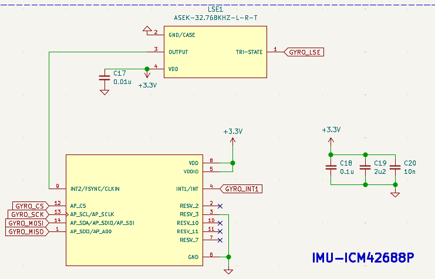
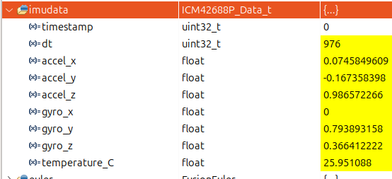
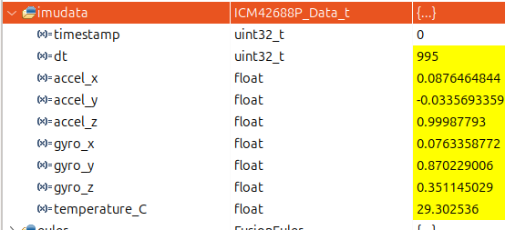

# 1. overview
The following content explains how to configure the ICM‑42688P IMU to use an external 32.768 kHz clock source connected to its CLKIN pin(Pin 9), instead of its internal RC oscillator or PLL. It covers the necessary hardware setup, software register configuration steps, and method to verify without oscilloscope access.

# 2. Clocking on the ICM‑42688P
The ICM‑42688P can be clocked by its internal RC/PLL or by an external low-frequency clock (typ. 32.768 kHz) connected to its CLKIN pin.  

Use a stable external clock for improved timing stability, lower jitter, and better long-term accuracy in time-sensitive applications.  

- Two register-level controls matter:
  - `INTF_CONFIG5` (bank 1): enables the physical IMU pin to accept external CLKIN.
  - `INTF_CONFIG1` (bank 0): `CLKSEL` bits choose the clock source; `CLKSEL = 01` selects the external 32.768 kHz. `RTC_MODE` bit (bit2) enables RTC/CLKIN mode.
- `INT_STATUS` contains a clock/PLL-ready bit (bit5). This indicates the IMU's clock domain is stable but does not by itself prove the external crystal is actually driving the IMU (the PLL may be ready using internal RC).

# 3. Hardware prerequisites
- External oscillator output physically connected to the IMU CLKIN pin 9.
  According to the schematic, the CLKIN pin is connected to the output of the oscillator 'ASEK-32.768KHZ-L-R-T'.
  
- As shown in the above schematics, GYRO_LSE(PB11) on the board wired to the oscillator enable input (drives oscillator ON when PB11 = HIGH).B11 is configured as a GPIO output.
- Oscillator output voltage must be compatible with the IMU CLKIN input (typically 3.3 V CMOS).

# 4. Software sequence to enable external CLKIN
Perform these steps in the IMU initialization routine (for example inside `ICM42688P_Init()`), in this order:

1. **Enable board oscillator (PB11 = HIGH)**  
   - Set PB11 high and wait a short time (e.g., 200 ms) to allow the oscillator to start.

2. **Enable IMU CLKIN pin (bank 1)**  
   - Select register Bank 1 and set `INTF_CONFIG5_B1` so the IMU pin 9 is configured for external CLKIN.

3. **Select external clock + enable RTC mode (bank 0)**  
   - Switch to Bank 0. Read `INTF_CONFIG1`, set `CLKSEL = 01` and set `RTC_MODE` (bit2) = 1, then write back. Add a short delay.

4. **Continue normal IMU setup**  
   Proceed with other IMU configurations (e.g., gyro/accel settings).

# 5. Practical verification without oscilloscope
According to the datasheet, after enabling external CLKIN, the IMU should use it as its clock source. However, to confirm this without an oscilloscope, we can check the timing stability of the IMU data sampling intervals (`imudata.dt`).
The default ODR is 1 kHz achieved with an 32KHz external clock, so with a stable external 32.768 kHz clock, the expected sampling interval should be around 32.768/32 times, which is around 1024Hz(interval is around 976-977 microseconds (1/1024 seconds). If the internal RC oscillator is used, the interval will be around 996 microseconds (1/1000 seconds).
So to verify the external clock is driving the IMU without an oscilloscope, use the following method:
- Chekc imudata.dt with PB11 ON vs OFF.
- With PB11 ON (oscillator enabled), the IMU should be driven by the stable external clock, resulting in a interval around 976-977us since 1024Hz can not be divided exactly using us unit.  
  

- With PB11 OFF (oscillator disabled), the IMU falls back to its internal RC oscillator, leading to a interval around 995-996us,which is is a typical manifestation of the internal RC oscillator's tolerance. This proves that the internal clock is indeed inaccurate. If performing attitude integration using a fixed 1000μs (1ms) interval, the angular increment will be overstated (leading to a larger-than-actual integral value) because the physical sampling is happening faster than expected.  
  

This verification method effectively demonstrates the impact of using an external clock source on the IMU's timing accuracy. The results show the motivation for using an external 32.768 kHz clock.
  

# 6. Checklist (quick)
- [ ] PB11 configured as GPIO output.
- [ ] PB11 enabled early in `ICM42688P_Init()`.
- [ ] Bank 1: enable IMU CLKIN pin.
- [ ] Bank 0: set `INTF_CONFIG1.CLKSEL = 01` and `RTC_MODE = 1`.
- [ ] Read back `INTF_CONFIG1` and verify bits set.
- [ ] Check dt with PB11 ON/OFF to confirm behavior.

The code is on the new branch called 'AdvancedFeatures' in our repo

