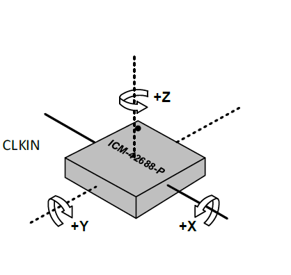
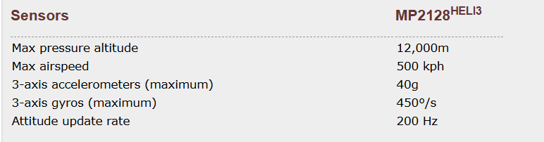

# Orientation and Coordinate Frame of IMU

## General Rules to Determin IMU Axies Direction

The positive direction for the angular velocity (rate of rotation) about any IMU axis (X, Y, or Z) is universally defined by the **Right-Hand Rule (RHR)**.

1.  **Application of the RHR:**
    * **Curl** the fingers of your right hand in the direction of the rotation.
    * **Extend** your right thumb.

2.  **Determining the Positive Direction:**
    * If the extended thumb points along the **positive direction of the axis** (e.g., in the +X, +Y, or +Z direction), the rotation is considered **Positive (+)**.

3.  **Determining the Negative Direction:**
    * If the extended thumb points along the **negative direction of the axis** (e.g., in the -X, -Y, or -Z direction), the rotation is considered **Negative (-)**.

On the other hand, curl the four fingers of the right hand in the direction of rotation, and the thumb points in the positive direction of that axis.

## Orientation of ICM42688-P

This definition explicitly links the IMU's internal coordinate axes to the physical reference mark on the package, as typically illustrated in the chip's datasheet as shown in the above figure:

1.  **Reference Mark Location:**
    * The chip package has a **small indentation or dimple** located near the **top-left corner**. This mark serves as the **Pin 1 Indicator** and the primary point of reference for the axis definition.

2.  **Defining the X-Axis (Right):**
    * The **$+X$ axis** is defined as running **parallel to the chip's plane**, starting from the marked side and pointing to the **right side** of the package.

3.  **Defining the Z-Axis (Up):**
    * The **$+Z$ axis** is defined as pointing **vertically upward**, perpendicular to the surface of the chip package. (This is the standard convention for MEMS sensors, where a stationary chip reports $\text{+1g}$ on the $\text{Z}$-axis).

4.  **Defining the Y-Axis (Forward/External) via the Right-Hand Rule (RHR):**
    * Following the **Right-Hand Rule**: Given the directions of $+X$ (Right) and $+Z$ (Up), the **$+Y$ axis** is determined to point **forward/outward**.
    * **Specifically:** The $+Y$ axis is perpendicular to the $X$ axis and points **away from the chip** across the marked edge (the "front" side defined by the dimple's location).

***

## Summary of IMU Output:

| Axis | Physical Direction | RHR Standard |
| :---: | :---: | :---: |
| **$+X$** | Right | Points right along the chip plane. |
| **$+Y$** | Forward / Outward | Points away from the chip, perpendicular to the marked edge. |
| **$+Z$** | Vertically Upward | Perpendicular to the chip surface (out of the page). |

# Selection of Full-scale Range 
## General Principles 

The setting of the Inertial Measurement Unit (IMU) Full-Scale Range (FSR) is a critical engineering decision that balances **Measurement Range (to prevent saturation)** and **Measurement Precision (to maximize resolution)**.

The core objective when setting the FSR is to select the **smallest possible range** that is **guaranteed to be greater than** the maximum expected measurement in the application.

* **Gyroscope Range (DPS) Setting:**
    * Select the **smallest available FSR** that is **at least 10-20% higher** than the **maximum angular rate** generated by the platform during its most intense maneuvers (e.g., emergency evasion or aerobatics).
    * **Reasoning:** A smaller range results in a higher digital **sensitivity** (LSB/DPS), which improves the accuracy of detecting small motions and reduces quantization noise.

* **Accelerometer Range (g) Setting:**
    * The FSR must cover the sum of **gravity**, **maximum dynamic maneuver acceleration**, and **environmental vibration peaks** across all axes.
    * **Reasoning:** Insufficient range leads to sensor output **saturation (clipping)**, causing the flight control system to receive distorted or unusable data, severely compromising attitude estimation and stability.

## ICM-42688-P Specification and Accelerometer Range Setting Analysis 

The easier way to configure the range is to take a comercial product on the market as a reference.  For example, We will analyze the setting of the ICM-42688-P's ranges by referencing the high-performance requirements of a UAV autopilot like the **Micropilot MP2128HELI3 UAV Autopilot** (Max Rate: 450 DPS, Max Accel: 32g).
  

The ICM-42688-P provides the following user-selectable FSR options: Gyroscope FSRs from 15.625 to 2000 DPS, and Accelerometer FSRs of 2g to 16g.

**Range Selection Outcomes:**

* **Gyroscope Selection:** To cover the **450 DPS** requirement, I would select the smallest available FSR that exceeds this value, which is **500 DPS**. This setting is deemed **suitable** as it optimizes resolution while covering the necessary dynamic range.
* **Accelerometer Selection:** The high-performance reference requires a measurement capability of up to 32g. Since the ICM-42688-P is limited to 16g, this is the highest possible setting. However, it is inadequate to measure the 32g force, leading to saturation in environments matching the Micropilot's maximum specification.

**Important Note (Regarding High-G Range):**

* The need for 32g or higher ranges in high-performance UAVs is generally for measuring **high-frequency, high-G vibration peaks** and instantaneous acceleration during non-damaging **hard landings** or **severe turbulence**. The sensor must be able to measure and filter these momentary peaks.
* For general implements in comsumer or industry mobile robots and aerial robots, 16g is a good enough choice for most cases.