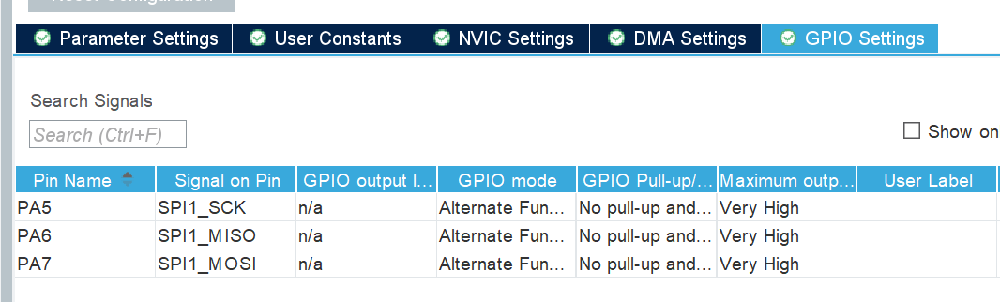

According to the schematic file, the sensor ICM42688-P is connected with the STM32F405 via SPI1. The next steps are to build connection with this IMU, and then a sequence of configurations need to set.
# SPI Clock Parameters
We need to check the SPI mode used by the IMU from the datasheet of IMU. Configuring the SPI parameters **CPOL** (Clock Polarity) and **CPHA** (Clock Phase) is a critical step to ensure correct communication between the **microcontroller (STM32)** and the **IMU (ICM-42688-P)**. These two parameters determin the SPI mode to set.

If the CPOL/CPHA settings of the STM32 and the IMU do not match, SPI communication will fail, and you will not be able to read the correct device ID (**WHO_AM_I**).


**CPOL (Clock Polarity)** — defines the state of the clock line (SCLK) when no data is being transferred.  
- CPOL = 0 → SCLK is **low** when idle.  
- CPOL = 1 → SCLK is **high** when idle.

**CPHA (Clock Phase)** — defines at which clock edge data is sampled.  
- CPHA = 0 → Data is sampled on the **first** clock edge (rising or falling).  
- CPHA = 1 → Data is sampled on the **second** clock edge.


According to the **ICM-42688-P datasheet**, the IMU supports the following SPI modes by default:

- **Mode 0:** CPOL = 0, CPHA = 0  
- **Mode 3:** CPOL = 1, CPHA = 1  

  
In practical applications, either mode can be used.  If the IMU does not specify a strict requirement, **Mode 3 (CPOL = 1, CPHA = 1)** is widely used and stable across the InvenSense/TDK sensor series.


# STM32 Configuration 

In the STM32 configuration tool in **CubeMX**, configure the SPI peripheral as follows:

- **CPOL (Clock Polarity)** = High (idle = High) → `1`  
- **CPHA (Clock Phase)** = Second edge (2 Edge) → `1`

On the page of SPI1 configuration, set full-duplex SPI and disable hardware CSS(Chip select) signal.  Since ICM-42688-P has separate MOSI and MISO, so it must use full-duplex SPI to transit and receive data simultaneously.  And I have CS pin connected to a GPIO of STM32, so we prefer use software to enable the CS signal.


we have five GPIOs need to set, **CubeMX** has set three of them:


CS and INIT pins are left to us.
CS Pin is labeled with `GYRO_CS` which is PC4 pin. Configure it as a regular GPIO output, and ensure that the software can manually pull it low and high.

INT Pin is labeled with 'GYRO_INI1' which is PB0. Configure it as an external interrupt (EXTI) to efficiently handle data-ready notifications.  


# Writing Communication Functions for IMU
We should be able to write a set of abstracted low-level read/write functions.
These functions form the foundation of your IMU driver and ensure stable, reliable communication between the STM32 and the ICM-42688-P.
The general archetecture for IMU operations is list below. We will finish the read/write API step by step.
```
                            HAL_SPI_TransmitReceive
                                     ↑
                                     │  (HAL Library)
                                     │
                            hal_Spi1_ReadWriteByte()
                                     ↑
                                     │  (lowest-level SPI byte transfer)
                                     │
                             Icm_Spi_ReadWriteNbytes()
                                     ↑
                                     │  (multi-byte transfer abstraction)
                                     │
                 ┌────────────────────────────────┐
                 │  ICM42688P_ReadReg()           │
                 │  ICM42688P_ReadRegs()          │
                 │  ICM42688P_WriteReg()          │
                 └────────────────────────────────┘
                                     ↑
                                     │  (device-specific read/write API)
                                     │
                 ICM42688P_Init(), ICM42688P_GetData(), etc.
                                     ↑
                                     │  (application level)
                                     │
                                    main()
```
## Core Implementation Logic and Rationale
In **STM32CubeIDE**:

1. Right-click `Core/Src` → **New → Source File** → name it: `ICM42688P.c`  
2. Right-click `Core/Inc` → **New → Header File** → name it: `ICM42688P.h`  
3. In `eeprom_test.c`, include the header file:
   ```
   #include "ICM42688P.h"
   ```
**How to Read Reg via SPI**
In SPI, communication is full-duplex, meaning data is always transmitted and received at the same time.However, the IMU doesn’t know which register you want to read from until you send its address.

So, to perform a read:

- First step:  pull CS low to start the SPI transaction.

- Second step: Send one byte: the register address with bit 7 set to 1 (reg | 0x80), which tells the IMU: “I want to read from this register.”

- Third step: For each subsequent clock cycle, the IMU outputs the data from that register (and subsequent ones if you keep reading multiple bytes).

- Finally: pull CS high to end the communication.

**Note**: We must write the register address to tell the IMU which internal register to output. Otherwise, the data returned will be meaningless.

**How to Write a Reg via SPI**
Similar with reading, 

So, to perform a write:

- First step: Pull CS low — this begins the SPI transaction.

- Second step: Send the register address — the most significant bit (bit 7) must be 0 (reg & 0x7F), which indicates a write operation.

- Third step: Send the data byte(s) — this is the value you want to store in that register.

- Finally: Pull CS high — this ends the SPI transaction, and the IMU latches the written data.

### Implement CS (Chip Select) Control

Create a macro or function to manually pull the CS pin low before each SPI transfer and release it high after the transfer.

**Note**: The ICM-42688-P requires the CS line to remain low for the entire transaction, including both the register address and the data phase.
If CS toggles incorrectly, the IMU will misinterpret the command or return corrupted data.

Define function-like macros to control CS signal in `ICM42688P.h`. They act similarly to function calls, but they are implemented as text substitution, which avoids the overhead of a function call (such as stack operations). 

```
#define Icm_CS_HIGH() HAL_GPIO_WritePin(GPIOC, GPIO_PIN_4, GPIO_PIN_SET)
#define Icm_CS_LOW()  HAL_GPIO_WritePin(GPIOC, GPIO_PIN_4, GPIO_PIN_RESET)
```

### Implement hal_Spi1_ReadWriteByte()
It is the lowest-level hardware access function, which directly interfaces with STM32’s SPI hardware through the HAL library.It performs one full-duplex byte transfer.
```
uint8_t hal_Spi1_ReadWriteByte(uint8_t txdata)
{
    uint8_t rxdata = 0;
    HAL_SPI_TransmitReceive(&hspi1, &txdata, &rxdata, 1, 5); /* STM32 HAL SPI transmit/receive function */
    return rxdata;
}

```

### Implement Icm_Spi_ReadWriteNbytes()
It is a wrapper layer around the low-level byte transfer.It calls hal_Spi1_ReadWriteByte() in a loop to transmit/receive multiple bytes.

It functions as a “multi-byte interface”, useful for sending commands or reading sensor blocks.
```
void Icm_Spi_ReadWriteNbytes(uint8_t* pBuffer, uint8_t len)
{
    uint8_t i = 0;
    for(i = 0; i < len; i++)
    {
        *pBuffer = hal_Spi1_ReadWriteByte(*pBuffer);
        pBuffer++;
    }
}

```

### Implement ICM42688P_ReadReg()

It is a interface to read one register from the IMU.

* Adds the read instruction bit (reg |= 0x80) 
* Controls the CS (Chip Select) pin before and after transmission.
* Calls Icm_Spi_ReadWriteNbytes() to actually send/receive data.
```
uint8_t ICM42688P_ReadReg(uint8_t reg)
{
    uint8_t regval = 0;
    Icm_CS_LOW();                /* Pull CS low to start SPI transaction */
    reg |= 0x80;                 /* Set MSB (D7) = 1 → SPI read operation */
    Icm_Spi_ReadWriteNbytes(&reg, 1);   /* Send register address */
    Icm_Spi_ReadWriteNbytes(&regval, 1);/* Receive register data */
    Icm_CS_HIGH();               /* Pull CS high to end SPI transaction */
    return regval;
}

```

### Implement ICM42688P_ReadRegs()

It is an interfance to read multi-bytes. For example, it is useful when reading consecutive 3-axies accelerometer registers.Same CS logic, but reads multiple bytes into a buffer, compared with `ICM42688P_ReadReg`.
```
void ICM42688P_ReadRegs(uint8_t reg, uint8_t* buf, uint16_t len)
{
    reg |= 0x80;
    Icm_CS_LOW();
    Icm_Spi_ReadWriteNbytes(&reg, 1);   /* Send starting register address */
    Icm_Spi_ReadWriteNbytes(buf, len);  /* Read multiple bytes into buffer */
    Icm_CS_HIGH();
}

```

### Implement ICM42688P_WriteReg()

Sends one byte of data to a specific register.Bit 7 (D7) must be 0, indicating a write operation.
Same CS control logic and use Icm_Spi_ReadWriteNbytes() for the SPI transmission.
```
uint8_t ICM42688P_WriteReg(uint8_t reg, uint8_t value)
{
    Icm_CS_LOW();
    Icm_Spi_ReadWriteNbytes(&reg, 1);   /* Send register address */
    Icm_Spi_ReadWriteNbytes(&value, 1); /* Write data to the register */
    Icm_CS_HIGH();
    return 0;
}

```
## Read IMU Device ID
We will write a test function to verify communication between the STM32 and the IMU (ICM-42688-P) by reading a special identification register called WHO_AM_I.

It will confirm the following functionalities are normal:

* The SPI bus works correctly.

* The wiring (MOSI, MISO, SCLK, CS) is functional.

* The IMU is powered on and responding.

If the function returns the expected ID 0x47, the connection is verified and the IMU is ready for initialization.


### Add function to Initialize the IMU
#### **1. Select Register Bank 0**
- **Action:** Write to `REG_BANK_SEL` with (`ICM42688P_REG_BANK0_REG_BANK_SEL`).
- **Purpose:** The ICM-42688-P uses a *banked register system*; selecting **Bank 0** ensures correct access to core registers.

#### **2. Power-Up Delay**
- **Action:** `HAL_Delay(50);`
- **Purpose:** Allow time for the IMU to stabilize after power-on.

#### **3. Reconfirm Bank 0 Selection**
- **Action:** Write to `REG_BANK_SEL` again (`ICM42688P_REG_BANK0_REG_BANK_SEL`).
- **Purpose:** Prevents misconfiguration if the device was in another bank before initialization.

#### **4. Soft Reset**
- **Action:** Write `BIT0` (`0x01`) to `DEVICE_CONFIG`.
- **Purpose:** Resets the IMU, restoring all registers to default values.
- **Delay:** Wait 500 ms for reset completion.

#### **5. Verify WHO_AM_I Register**
- **Action:** Read from `WHO_AM_I` (address `0x75`).
- **Expected Value:** `0x47` for the ICM-42688-P.
- **Error Handling:**  
  If the value doesn’t match, enter an infinite loop blinking LEDs to indicate SPI communication failure.

#### **6. Stabilization Delay**
- **Action:** `HAL_Delay(1000);`
- **Purpose:** Ensures the sensor is fully ready before further register configuration.

```
void ICM42688P_Init(void)
{

    /*-----------------------------------------------------------
     * Step 0: Ensure we are operating in Register Bank 0.
     * ----------------------------------------------------------
     * The ICM-42688-P uses a "banked register" architecture.
     * Writing 0x00 to register 0x76 selects Bank 0.
     */
    ICM42688P_WriteReg(ICM42688P_REG_BANK0_REG_BANK_SEL, ICM42688P_REG_BANK_SEL_0);


    /* Wait for sensor to power up (recommended after power-on). */
    HAL_Delay(50);

    /* Explicitly select Register Bank 0 again for safety. */
    ICM42688P_WriteReg(ICM42688P_REG_BANK0_REG_BANK_SEL, ICM42688P_REG_BANK_SEL_0);

    /*-----------------------------------------------------------
     * Step 1: Soft Reset
     * ----------------------------------------------------------
     * A soft reset ensures the device starts from a clean, known state.
     * After reset, all registers return to default values.
     */
    ICM42688P_WriteReg(ICM42688P_REG_BANK0_DEVICE_CONFIG, BIT0);
    HAL_Delay(500);  // Allow sufficient time for reset to complete

    /*-----------------------------------------------------------
     * Step 2: Verify Communication (Read WHO_AM_I)
     * ----------------------------------------------------------
     * The WHO_AM_I register (0x75) should return 0x47 for ICM-42688-P.
     * If not, stay in an error loop and blink LEDs for debugging.
     */
    who_am_i = ICM42688P_ReadReg(ICM42688P_WHO_AM_I_ADDR);
    if (who_am_i != ICM42688P_DEVICE_ID)
    {
        while (1)
        {
            HAL_GPIO_TogglePin(GPIOB, GPIO_PIN_4);
            HAL_Delay(100);
            HAL_GPIO_TogglePin(GPIOB, GPIO_PIN_5);
            HAL_Delay(100);
        }
    }
    HAL_Delay(1000);
}

```

### Check ID in main.c before the while loop
Define global variable uint8_t imu_id = 0;
Using the Live expression window to check the value of imu_id
```
    imu_id = ICM42688P_ReadDeviceID();

    if (imu_id == ICM42688P_DEVICE_ID)
    {
        // Proceed with IMU initialization
    }
    else
    {
        // Handle communication error
    }
```

## Wrap up
Next time, we will disucss more about the sensor configuration and details in the above initialization function.