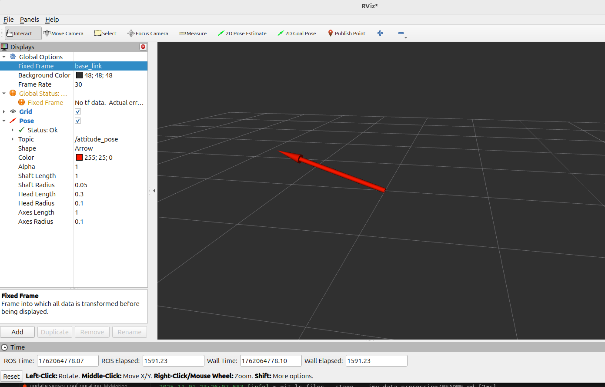
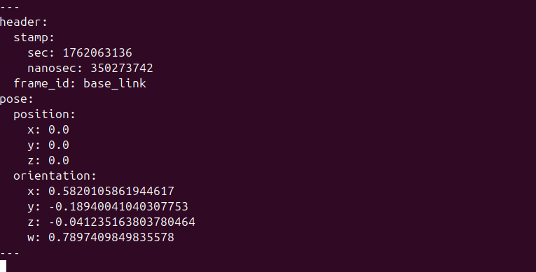
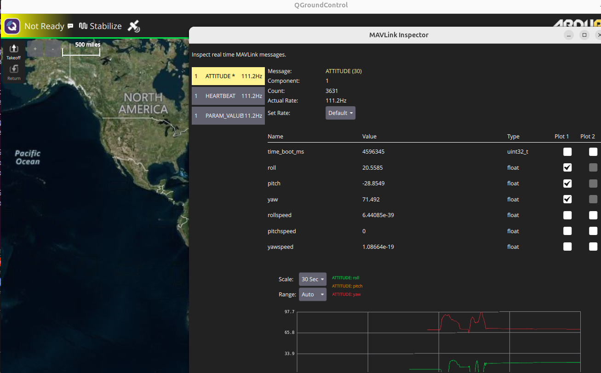

# IMU data processing

<<<<<<< HEAD
=======
In this section, we will show the attitude of IMU are converted to ROS2 messages.

## Mavlink messages displayed in Qgroundstation
Since the message sent out through the uart is with the standard MAVLink message type, it can be received and decoded by other ground stations which support Mavlink such as the Qground station  and the GUI I build using python as I mentioned at the beginning of this tutorial.

[Qgroundstation](https://qgroundcontrol.com/) is a powerful groundstation for PX4 autopilot.

Add a serial link in Qgroundstation and connect the IMU module via a serial-usb cable(In Pumbaa this cable is intergrated to the PCB.)  Open the **MAVlink Inspector** in **Analyse tools**, we can see the attitude message, heartbeat message and parameter messages sent from IMU.



We can see the update frequency is degraded to around 100Hz.  I have not investigated this deeply, while it is potentially relevant with internal configuration of Qgroundstation.  Although, Qgroundstation is a convinent tool to check the mavlink from the serial interface.


## Deconde mavlink messages and publish the ROS2 message
Basically the meaningful data can be filtered out by the following code and the data in the ATTITUDE message will be decoded and passed to 'msg' which includes the roll, pitch and yaw angles.
```
msg = self.master.recv_match(type=['ATTITUDE'], blocking=False)
```

Then the angles are converted to quaternion using scipy library and put in a 'PoseStamped' ROS2 message. Here the details are not given, since it requires lots of knowledge of Ubuntu/ROS2 and Python3.   I want to show that the converted ROS2 message can be viewed in  rviz2 or the command 'ros2 topic echo'. 





## sum up
The above conversion from Mavlink to ROS2 shows the advantage of sending out data from IMU with MAVLink library. You can use MAVROS library to help with the conversion, while it is designed for PX4 software stack. I perfer to decode and publish the ROS2 messages with own scripts, which are more flexible.

If you are interested with this part. Feel free to contact with me and I am glad to discuss more with you.

 
>>>>>>> e2a8885 (update)
